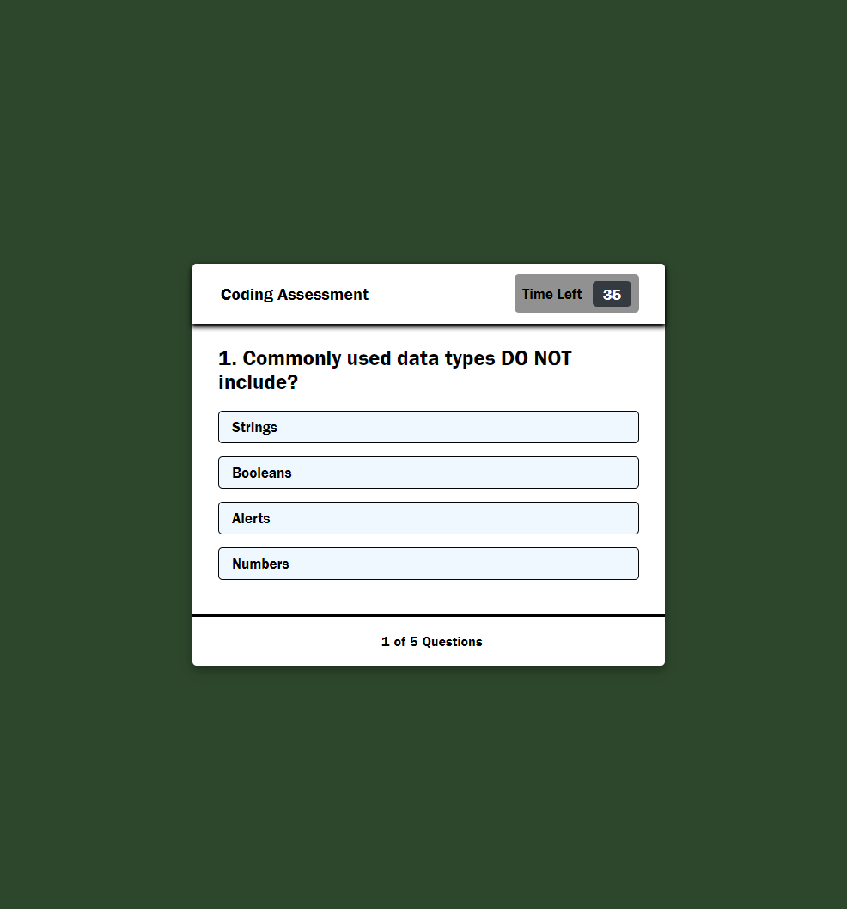

# CodingAssessment

## Your Task

As you proceed in your journey to becoming a full-stack web developer, it’s likely that you’ll be asked to complete a coding assessment, perhaps as part of an interview process. A typical coding assessment is a combination of multiple-choice questions and interactive coding challenges.

To help you become familiar with these tests and give you a chance to apply the skills from this module, this week’s Challenge invites you to build a timed coding quiz with multiple-choice questions. This app will run in the browser, and will feature dynamically updated HTML and CSS powered by JavaScript code that you write. It will have a clean, polished, and responsive user interface. This week’s coursework will teach you all the skills you need to succeed in this assignment.

## NOTE

Coding assessments are an important part of the interview process for developers. In fact, employers often use them to filter out job candidates with a cut-off score. To help you prepare, we’ve developed a set of technical interview questions that you can answer throughout the course. The difficulty level of these questions will increase as you become a more proficient developer. If you take advantage of these opportunities to practice, you should be well-prepared to shine during the technical interview process toward the end of this course!

## User Story
```
AS A coding boot camp student
I WANT to take a timed quiz on JavaScript fundamentals that stores high scores
SO THAT I can gauge my progress compared to my peers
```
## Acceptance Criteria
```
GIVEN I am taking a code quiz
WHEN I click the start button
THEN a timer starts and I am presented with a question
WHEN I answer a question
THEN I am presented with another question
WHEN I answer a question incorrectly
THEN time is subtracted from the clock
WHEN all questions are answered or the timer reaches 0
THEN the game is over
WHEN the game is over
THEN I can save my initials and score
```



### Deployed URL 

I have put together a small quiz that asks a total of 5 questions regarding coding. When you click the Start button it shows an onfo page telling you about the 60 second timeframe once you accept then the quiz begins. The timer start as the first question is displayed and counts down until you have finished your quiz. When you click on the answer it will display whether you have made the corrct choice or not than the you click "Next >" the procced to the next question. The timer does not stop when you answer all the questions. When all five questions have been answered then you recieve a results window displaying your score and a message that correlates to the score you recieved.


### Challenge 4 - Code Assessment Quiz
Completed By: Corey Boensch
